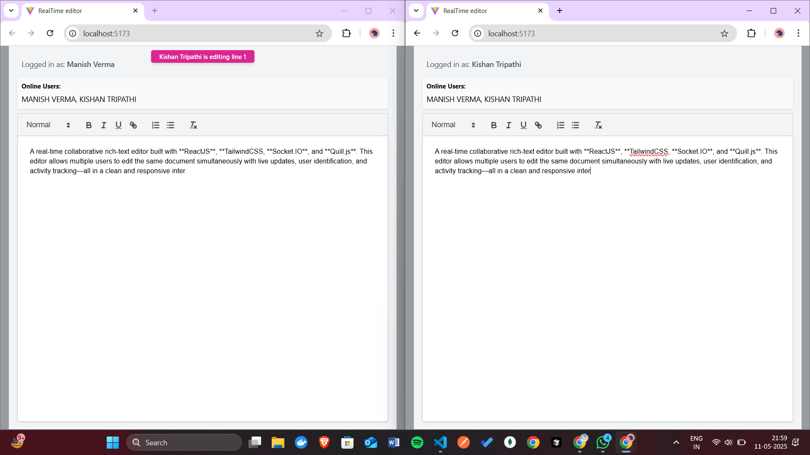

# 📝 Real-Time Collaborative Editor

A real-time collaborative rich-text editor built with **ReactJS**, **TailwindCSS**, **Socket.IO**, and **Quill.js**. This editor allows multiple users to edit the same document simultaneously with live updates, user identification.

---
##  Screenshots

-  **Login Page**


-  **Editor Page**



---
## Live URL

- **URL -** https://wasserstoff-task1.vercel.app/

## 🚀 Features

- 🧑‍🤝‍🧑 **Multi-User Real-Time Editing**  
  Edits made by one user are instantly synchronized across all connected clients via WebSockets.

- 🔄 **Live Synchronization**  
  Changes propagate in real-time using efficient WebSocket communication.

- 🧑 **User Identification**  
  Each user enters a unique name/ID when joining, shown to all collaborators.

- ✍️ **Live Edit Tracking**  
  Visual indicators for who is typing, where their cursor is, or what was changed.

- 💻 **Rich Text Editing**  
  Formatting support like bold, italic, underline, headers, bullet lists, and more via Quill.js.

- 🌐 **Responsive Design**  
  Styled with TailwindCSS for modern and mobile-friendly UI.

- 🧩 **Modular & Lightweight**  
  Can run locally without a database. Perfect for demos or personal use.

---

## 🛠️ Tech Stack

- **Frontend:** ReactJS, Quill.js, TailwindCSS  
- **Backend:** Node.js, Express, Socket.IO  
- **Communication:** WebSockets (via Socket.IO)

---

## 📦 Installation & Setup Guide

### 🔁 Clone the Repository

```bash
git clone https://github.com/your-username/realtime-collab-editor.git
cd realtime-collab-editor
```

### 🖥️ Start the Project Locally

#### 1. Install Dependencies

Navigate to the project directory and install dependencies for both the frontend and backend:

```bash
# Install backend dependencies
cd server
npm install

# Install frontend dependencies
cd ../client
npm install
```

#### 2. Start the Backend Server

Run the backend server:

```bash
cd Server
npm start
```

The backend server will start on `http://localhost:3001` (or the port specified in your configuration).

#### 3. Start the Frontend Development Server

Run the frontend development server:

```bash
cd ../client
npm run dev
```

The frontend will start on `http://localhost:5173/` by default.

---

### 🌟 Access the Application

Once both servers are running, open your browser and navigate to `http://localhost:5173/` to use the application.

## 🤝 Contribution

Contributions are always welcome! If you'd like to contribute to this project, follow these steps:

1. **Fork the Repository**  
   Click the "Fork" button at the top-right corner of this repository to create your own copy.

2. **Clone Your Fork**  
   Clone your forked repository to your local machine:

   ```bash
   git clone https://github.com/your-username/realtime-collab-editor.git
   cd realtime-collab-editor
   ```

3. **Create a New Branch**  
   Create a new branch for your feature or bug fix:

   ```bash
   git checkout -b feature-name
   ```

4. **Make Changes**  
   Make your changes and commit them with a meaningful commit message:

   ```bash
   git add .
   git commit -m "Add a meaningful commit message"
   ```

5. **Push Changes**  
   Push your changes to your forked repository:

   ```bash
   git push origin feature-name
   ```

6. **Open a Pull Request**  
   Go to the original repository on GitHub and open a pull request from your forked repository.

---

### 💡 Guidelines

- Ensure your code follows the project's coding standards.
- Write clear and concise commit messages.
- Test your changes thoroughly before submitting a pull request.
- If you're adding a new feature, update the documentation accordingly.

Thank you for contributing! 😊